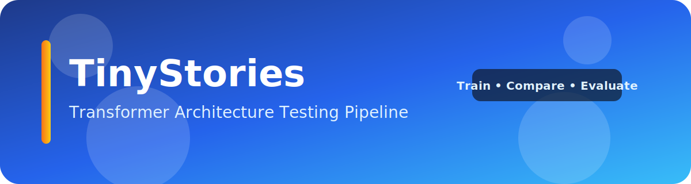

# TinyStories Transformer Architecture Testing Pipeline



A reproducible pipeline to **train, compare, and evaluate** modern decoder-only Transformer language models on the TinyStories dataset. The project emphasizes fast architectural experimentation, consistent logging, and automated run comparisons so you can iterate with confidence.

---

## ✨ Highlights
- **Modern GPT-style baseline** with pre-norm RMSNorm, SwiGLU MLP, RoPE, AdamW, warmup + cosine LR, optional FlashAttention, `torch.compile`, and mixed precision.
- **Pluggable model variants** (baseline, residual scaling, grouped/multi-query attention example) via a lightweight registry.
- **Reproducible runs** with fixed seeds, deterministic flags (where reasonable), and self-contained run folders.
- **Rich metrics** in CSV + TensorBoard, including per-layer grad/weight norms.
- **Comparison CLI** for overlay plots and run summaries.
- **Prompt evaluation harness** with scoring by category and difficulty.

---

## 📚 Table of Contents
- [Install](#-install)
- [Quickstart](#-quickstart)
- [Dataset caching & variants](#-dataset-caching--variants)
- [Add a new variant](#-add-a-new-variant)
- [Compare runs](#-compare-runs)
- [Prompt eval harness](#-prompt-eval-harness)
- [Story probe](#-story-probe)
- [Credits](#credits)
- [Tests](#-tests)

---

## 🛠️ Install
```bash
python -m venv .venv
.venv/Scripts/activate  # Windows
pip install -r requirements.txt
```

---

## 🚀 Quickstart
> **Note:** Training currently requires a CUDA-capable GPU.

```bash
# baseline training
python -m src.train --config configs/baseline.yaml

# residual scaling variant
python -m src.train --config configs/variant_residual_scaling.yaml

# attention variant (GQA/MQA)
python -m src.train --config configs/variant_attention_change.yaml

# smoke test (short CUDA run)
python -m src.train --config configs/baseline.yaml --max_steps 50 --device cuda

# full-data run (override config default)
python -m src.train --config configs/baseline.yaml --override data.dataset_variant=full
```

Runs are written to `runs/<run_name>` by default. Each run folder includes:
- `config.json`
- `metrics.csv`
- `summary.json`
- TensorBoard logs
- Plots
- Optional checkpoints

---

## 🧠 Dataset caching & variants
- Datasets download once into `data/cache` (configured via `data.cache_dir`) and are reused across runs.
- Choose between the full dataset (`data.dataset_variant: full`) or a cached subset (`data.dataset_variant: small`).
- Current config defaults in `configs/*.yaml` are set to `small`, so no override is needed for small-data training.
- The small split keeps the first `data.small_train_samples` and `data.small_val_samples` examples (defaults: 50,000 / 5,000). Override these in configs or with `--override`.
- Raw caching is handled by the Hugging Face `datasets` cache; preprocessing still happens each run to respect tokenizer/sequence length changes.

---

## 🧩 Add a new variant
1. Implement a new module in `src/models/variants.py` (follow existing examples).
2. Register it in `src/models/registry.py` by adding an entry to `MODEL_REGISTRY`.
3. Create a config YAML pointing `model.name` to your variant and adjusting hyperparameters.
4. Train with `python -m src.train --config your_config.yaml`.

---

## 📊 Compare runs
```bash
python -m src.compare --runs_dir runs --out_dir comparisons
```

Generates overlay plots (loss, grad norms, weight norms) and `summary_table.csv`.

---

## 🧪 Prompt eval harness
Use this to score checkpoints on targeted prompts (gender, counting, associations, etc.). Each prompt has a `difficulty` and `score`, and the harness awards points only when the answer passes.

```bash
# evaluate all runs in runs/ using the latest checkpoint in each run folder
python -m src.eval_harness --runs_dir runs --prompts eval/prompts_tinystories.json --out_dir comparisons/eval_harness

# evaluate only selected runs
python -m src.eval_harness --runs_dir runs --run_names baseline variant_attention_change --prompts eval/prompts_tinystories.json

# evaluate a specific checkpoint step
python -m src.eval_harness --runs_dir runs --checkpoint_step 4000 --prompts eval/prompts_tinystories.json
```

Outputs are written to `comparisons/eval_harness` by default:
- `eval_results.csv`: one row per prompt completion.
- `summary_table.csv` / `summary_table.md`: per-run overall accuracy and weighted score.
- `category_breakdown.csv`: per-run scores by category.
- `difficulty_breakdown.csv`: per-run scores by difficulty.

Prompt file format:

```json
{
  "prompts": [
    {
      "id": "gender_001",
      "category": "gender",
      "difficulty": 1,
      "score": 1,
      "prompt": "Tom is a boy. Lily is a",
      "answers": ["girl"],
      "match": "contains"
    }
  ]
}
```

Notes:
- `match` supports `contains` (default), `exact`, `prefix`, and `regex`.
- Use higher `difficulty` and higher `score` for harder reasoning items.
- For TinyStories-style checks, include buckets like:
  - gender/pronoun understanding
  - counting and simple arithmetic
  - semantic associations (fruits/vegetables, animals/habitats)
  - short reading comprehension (where is X, who is Y)

---

## ?? Story probe
Generate story continuations from all trained runs for the same prompt.

```bash
# one completion per run
python -m src.story_probe --runs_dir runs --prompt "Once upon a time in a tiny village, a small fox found a key."

# multiple samples per run + save JSON
python -m src.story_probe --runs_dir runs --prompt "Lily opened the old box and saw a glowing map." --num_samples 3 --temperature 0.9 --top_k 50 --out_json comparisons/story_probe/completions.json

# select specific runs / checkpoint
python -m src.story_probe --runs_dir runs --run_names baseline variant_attention_change --checkpoint_step 4000 --prompt "Tom and Mia went into the forest to find a lost puppy."
```

---

## Credits
- TinyStories dataset and benchmark were introduced by **Ronen Eldan** and **Yuanzhi Li**.
- Paper: *TinyStories: How Small Can Language Models Be and Still Speak Coherent English?*  
  https://arxiv.org/abs/2305.07759
- Dataset page: https://huggingface.co/datasets/roneneldan/TinyStories

---

## ✅ Tests
```bash
pytest
```
